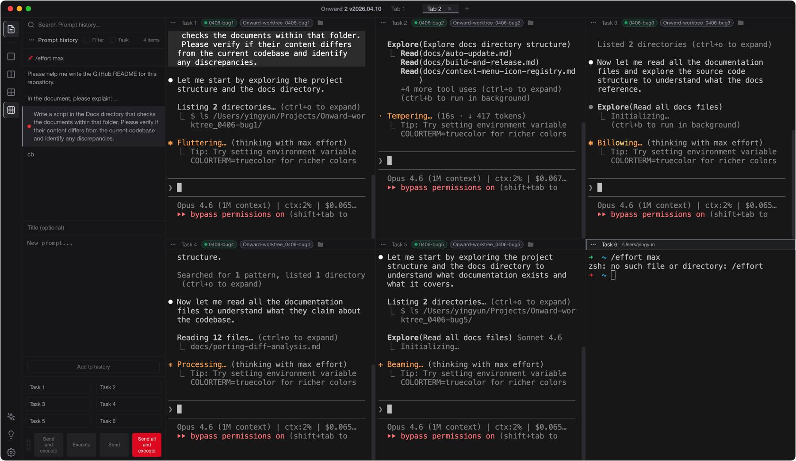
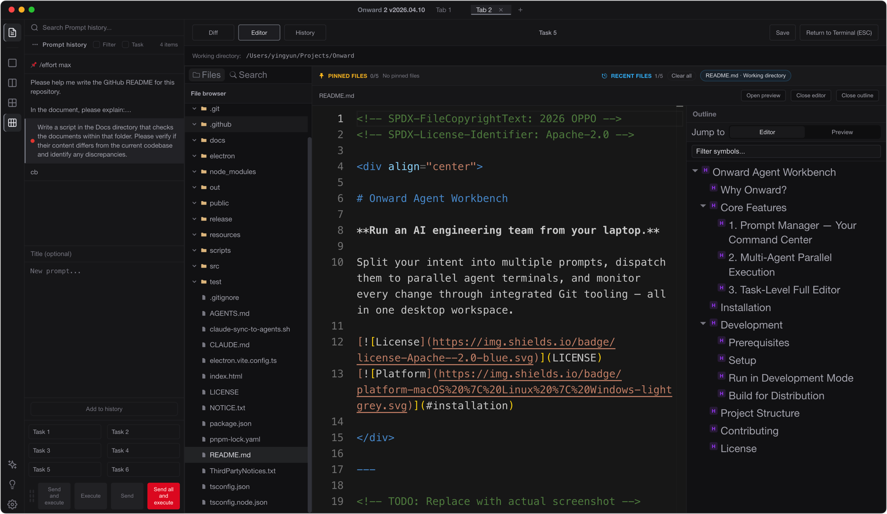

<!-- SPDX-FileCopyrightText: 2026 OPPO -->
<!-- SPDX-License-Identifier: Apache-2.0 -->

<div align="center">

# Onward Agent Workbench

**Agent first. Editor last.**

The desktop workspace where AI agents write code in parallel — and you lead the team.

[](LICENSE)
[](#installation)
[](https://github.com/OPPO-PersonalAI/Onward-Agent-Workbench/releases/latest)

</div>

---

<p align="center">
  
</p>

https://github.com/user-attachments/assets/53258d2b-0866-49a5-b222-12b2e4ef0b57

---

## Why Onward?

Traditional IDEs are **editor first** — you type, the AI assists. Onward flips this around.

In Onward, **agents do the coding**. You plan the work, dispatch prompts, and review what they built. The editor is there when you need it, not as the starting point.

This is for developers who run multiple AI coding agents (Claude Code, Codex ...) and need a single workspace to orchestrate them all.

---

## Core Features

### 1. Prompt Manager — Your Command Center

The left-side Prompt Manager is where you compose, organize, and schedule the work your agents will do.

- **Write and arrange prompts** before dispatching — plan your work like a backlog
- **Scheduled execution** — set prompts to fire on a timer so agents pick up work as they become idle
- **Color-tagging and pinning** — mark priority, filter by status, keep frequently-used prompts at hand
- **Import / Export** — share prompt libraries across machines or teammates

This is the key differentiator from VS Code or single-agent tools: you manage *what to do* separately from *who does it*, enabling true parallel orchestration.

### 2. Multi-Agent Parallel Execution

Onward natively supports running multiple AI agents side-by-side, each in its own terminal window.

- **Grid layouts** — single, dual, quad, or six-terminal views
- **Broadcast dispatch** — send prompts to selected agents simultaneously
- **Independent sessions** — each agent has its own working directory, context, and history
- **Works with any CLI agent** — Claude Code, Codex, Aider, or your custom toolchain

Agents write code in parallel. You stay in control.

### 3. Task-Level Full Editor

<table><tr><td width="55%">

After agents finish writing code, you need to review what changed. Each task gets its own integrated editor with full inspection capabilities.

- **Git Diff viewer** — side-by-side visual comparison of all changes
- **Git History** — browse commit logs and understand the evolution of each task
- **Code editor** — Monaco-powered (same engine as VS Code) for quick fixes
- **Markdown preview** — renders LaTeX, Mermaid diagrams, and syntax-highlighted blocks
- **Global search** — ripgrep-powered full-text search across your project

One workspace per task. Complete visibility into what every agent did.

</td><td>



</td></tr></table>

---

## Installation

Download the latest release for your platform:

**[Download Latest Release](https://github.com/OPPO-PersonalAI/Onward-Agent-Workbench/releases/latest)**

| Platform | Format |
|----------|--------|
| macOS | `.dmg`, `.zip` |
| Windows | `.exe` (NSIS installer), `.zip` |

### macOS: Unsigned App Permission

Onward is not code-signed with an Apple Developer certificate. macOS Gatekeeper will block the app on first launch. To allow it to run:

**Option A — System Settings (recommended)**

1. Open the app — macOS will show *"Onward 2" cannot be opened because the developer cannot be verified*
2. Go to **System Settings → Privacy & Security**
3. Scroll down — you will see a message about "Onward 2" being blocked
4. Click **Open Anyway**, then confirm

**Option B — Terminal**

```bash
# Remove the quarantine attribute (run once after download)
xattr -cr "/Applications/Onward 2.app"
```

---

## Tech Stack

```
┌──────────────────────────────────────────────────┐
│                   Renderer (UI)                   │
│  React 18 · TypeScript · Vite                    │
│  xterm.js (WebGL) · Monaco Editor · Mermaid      │
├──────────────────────────────────────────────────┤
│               Preload (Secure Bridge)             │
│  Context-isolated IPC API                        │
├──────────────────────────────────────────────────┤
│              Main Process (Backend)               │
│  Electron 39 · node-pty · better-sqlite3         │
│  Git operations · ripgrep · File watchers        │
└──────────────────────────────────────────────────┘
```

| Layer | Technology | Role |
|-------|-----------|------|
| **Shell** | [Electron](https://www.electronjs.org/) 39 | Cross-platform desktop runtime |
| **UI** | [React](https://react.dev/) 18 + [TypeScript](https://www.typescriptlang.org/) | Component-based renderer |
| **Build** | [Vite](https://vitejs.dev/) + [electron-vite](https://electron-vite.org/) | Fast HMR and bundling |
| **Terminal** | [xterm.js](https://xtermjs.org/) + WebGL addon | GPU-accelerated terminal rendering |
| **PTY** | [node-pty](https://github.com/microsoft/node-pty) | Native pseudo-terminal for each agent |
| **Editor** | [Monaco Editor](https://microsoft.github.io/monaco-editor/) | VS Code's editing engine |
| **Storage** | [better-sqlite3](https://github.com/WiseLibs/better-sqlite3) | Local DB for prompts, settings, state |
| **Search** | [@vscode/ripgrep](https://github.com/nicedoc/vscode-ripgrep) | Fast full-text search |
| **Rendering** | [Marked](https://marked.js.org/) · [Mermaid](https://mermaid.js.org/) · [KaTeX](https://katex.org/) | Markdown, diagrams, LaTeX |

---

## Development

### Prerequisites

- [Node.js](https://nodejs.org/) >= 20
- [pnpm](https://pnpm.io/) >= 9
- Python 3 (required by `node-gyp` for native modules)
- Platform build tools:
  - **macOS**: Xcode Command Line Tools
  - **Windows**: Visual Studio Build Tools with C++ workload

### Setup

```bash
# Clone the repository
git clone https://github.com/OPPO-PersonalAI/Onward-Agent-Workbench.git
cd Onward-Agent-Workbench

# Install dependencies (also rebuilds native modules)
pnpm install
```

### Run in Development Mode

```bash
pnpm dev
```

### Build for Distribution

```bash
# Development build (faster, with DevTools enabled)
rm -rf out release && pnpm dist:dev

# Production build
rm -rf out release && pnpm dist
```

The packaged application will be output to the `release/` directory.

---

## Project Structure

```
electron/
├── main/          # Main process — PTY, Git, SQLite, file system, IPC handlers
└── preload/       # Secure bridge between main and renderer
src/
├── components/    # UI components (terminal grid, prompt manager, editor, ...)
├── hooks/         # Shared React hooks (ESC handling, shortcuts, ...)
├── i18n/          # Internationalization (en, zh-CN)
├── terminal/      # Terminal session management
├── themes/        # Color theme definitions
├── types/         # Shared TypeScript type definitions
├── utils/         # Utility functions
└── workers/       # Web Workers for background tasks
```

---

## Contributing

We welcome contributions. Please see [CONTRIBUTING.md](CONTRIBUTING.md) for guidelines.

---

## License

[Apache-2.0](LICENSE) · Copyright © 2026 OPPO
